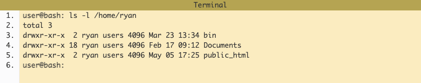

# Notes on The Command Line

## The Command Line

Any quotes or images in this section are [from this article](https://ryanstutorials.net/linuxtutorial/commandline.php).

### So what are they exactly?

Command line, or terminal, is a text-based interface to the system. Commands are entered by typing on the keyboard and feedback is given as text.

Example:

In the above:

- Line 1 has the prompt `user@bash` followed by the `ls` command we entered, followed by the command line arguments of `-l /home/ryan` (all of which are followed by spaces). `-l` is also known as an option. Options typtically start with a dash and modify the command behavior.
- Lines 2-5 are the output from running the command.
- Line 6 presents the prompt again, awaiting a new command.

### Opening a Terminal

- On Mac: Applications -> Utilities -> Spotlight -> Terminal
- On Linux: Applications -> System or Applications -> Utilities

### The Shell, Bash

The shell is the part of the operating system defining how the terminal will behave an display after running commands. The most common shell is bash (stands for Bourne again shell). Check which shell is in use with `echo` command.

### Shortcuts

History of commands can be accessed typically by hitting up arrow a few times.

## Basic Navigation

[Link to article](https://ryanstutorials.net/linuxtutorial/navigation.php)

### Summary of Basic Navigation

Commands learned:

- `pwd` --> Print Working Directory - ie. Where are we currently.
- `ls` --> List the contents of a directory.
- `cd` --> Change Directories - ie. move to another directory.

Important Concepts:

- Relative path --> A file or directory location relative to where we currently are in the file system.
- Absolute path --> A file or directory location in relation to the root of the file system.

## More About Files

[Link to article](https://ryanstutorials.net/linuxtutorial/aboutfiles.php)

### Summary of More About Files

Commands learned:

- `file` --> obtain information about what type of file a file or directory is.
- `ls -a` --> List the contents of a directory, including hidden files.

Important Concepts:

- Everything is a file under Linux. Even directories.
- Linux is an extensionless system. Files can have any extension they like or none at all.
- Linux is case sensitive. Beware of silly typos.

## Manual Pages

[Link to article](https://ryanstutorials.net/linuxtutorial/manual.php)

### Summary of Manual Pages

Commands learned:

- `man <command>` --> Look up the manual page for a particular command.
- `man -k <search term>` --> Do a keyword search for all manual pages containing the given search term.
- `/<term>` --> Within a manual page, perform a search for 'term'
- `n` --> After performing a search within a manual page, select the next found item.

Important Concepts:

- The man pages are your friend. Instead of trying to remember everything, instead remember you can easily look stuff up in the man pages.

## File Manipulation

[Link to article](https://ryanstutorials.net/linuxtutorial/filemanipulation.php)

### Summary of File Manipulation

Commands learned:

- mkdir --> Make Directory - ie. Create a directory.
- rmdir --> Remove Directory - ie. Delete a directory.
- touch --> Create a blank file.
- cp --> Copy - ie. Copy a file or directory.
- mv --> Move - ie. Move a file or directory (can also be used to rename).
- rm --> Remove - ie. Delete a file.

Important Concepts:

- No undo --> The Linux command line does not have an undo feature. Perform destructive actions carefully.
- Command line options --> Most commands have many useful command line options. Make sure you skim the man page for new commands so you are familiar with what they can do and what is available.

## Cheat Sheet

[Link to Cheat Sheet](https://ryanstutorials.net/linuxtutorial/cheatsheet.php)
