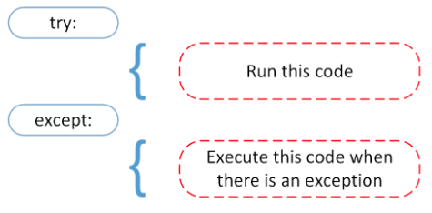
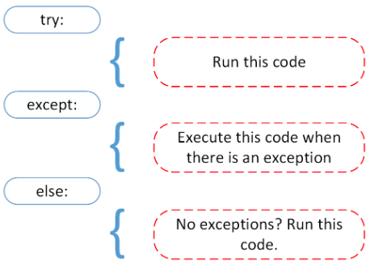
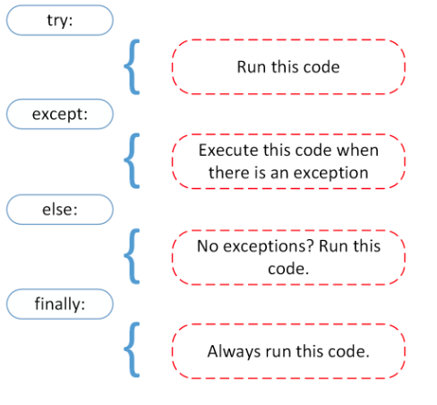

# FileIO & Exceptions

## Read & Write Files in Python

Quotes and example code from [this Real Python article](https://realpython.com/read-write-files-python/)

### What is a file?

A file is typically composed of three parts:

1. Header: metadata about file contents
2. Data: file contents written by creators/editors
3. End of file (EOF): indicated by special character

### File Paths

...are strings that represent the location of a file, and are broken up into:

1. Folder Path
2. File Name
3. Extension

### Line Endings

"Windows uses the CR+LF characters to indicate a new line, while Unix and the newer Mac versions use just the LF character." (\r\n on Windows or just \n on Mac)

### Character Encodings

Encoding is the translation to human readable characters from byte data. Two most common are ASCII and UNICODE Formats: the former can only store 128 characters, while the latter can store up to 1,114,112 (ASCII is a subset of Unicode/UTF-8).

### Opening and Closing a File in Python

The open built-in function:

`file = open('file_name.txt')`

It is my responsibility to close a file I have opened. There are two main ways.

First way is a `try-finally` block:

```Python
reader = open('dog_breeds.txt')
try:
    # Further file processing goes here
finally:
    reader.close()
```

Second way is using a `with` statement (IDEAL METHOD) which automatically closes file once it leaves `with` block, even when errors come up:

```Python
with open('dog_breeds.txt') as reader:
    # Further file processing goes here
```

Other options for modes:

- 'r': open for reading (default)
- 'w': open for writing, truncating (overwriting) the file first
- 'rb' or 'wb': open in binary mode (read/write using byte data)

A file object is [“an object exposing a file-oriented API (with methods such as read() or write()) to an underlying resource.”](https://docs.python.org/3/glossary.html#term-file-object) There are three types of file objects:

- Text files
- Buffered binary files
- Raw binary files

### Text File Types

examples of how to open text files:

```Python
open('abc.txt')

open('abc.txt', 'r')

open('abc.txt', 'w')
```

A `TextIOWrapper` file object will be returned.

### Buffered Binary File Types

examples of how to open them:

```Python
open('abc.txt', 'rb')

open('abc.txt', 'wb')
```

A `BufferedReader` or `BufferedWriter` file object will be returned.

### Raw File Types

They are used as "low-level" building blocks, so not typical.

### Reading and Writing Opened Files

Methods to call on file object to read file:

- `.read(size=-1)`: reads it based on number of `size` bytes (if size=0 or -1 or None is passed, entire file read)
- `.readline(size=-1)`: reads (at most) size # of characters from the line (if 0,-1, None -- entire file read)
- `.readlines()`: reads remaining file object lines and returns them as list items

### Iterating Over Each Line In The File

Example with `.readline()`:

```Python
with open('dog_breeds.txt', 'r') as reader:
    line = reader.readline()
    while line != '':  # The EOF char is an empty string
        print(line, end='')
        line = reader.readline()
```

Example with `.readlines()`:

```Python
    with open('dog_breeds.txt', 'r') as reader:
        for line in reader.readlines():
            print(line, end='')
```

Or simply by iterating over file object itself (most Pythonic approach):

```Python
    with open('dog_breeds.txt', 'r') as reader:
        # Read and print the entire file line by line
        for line in reader:
            print(line, end='')
```

Methods for writing to a file:

- `.write(string)`: writes string to file
- `.writelines(seq)`: writes the sequence to the file (no line endings are appender, so writer must add appropriate ones.)

Example of both:

```Python
with open('dog_breeds.txt', 'r') as reader:
    # Note: readlines doesn't trim the line endings
    dog_breeds = reader.readlines()

with open('dog_breeds_reversed.txt', 'w') as writer:
    # Alternatively you could use
    # writer.writelines(reversed(dog_breeds))

    # Write the dog breeds to the file in reversed order
    for breed in reversed(dog_breeds):
        writer.write(breed)
```

### The remainder of this article covers

- working with bytes
- a full example of reading and writing to a file
- more tips and tricks (including appending a file, working with two files at the same time, and creating your own context manager)
- reading and writing CSV files in Python
- working with JSON data in Python

Again, [the link to this article](https://realpython.com/read-write-files-python/).

## Python Exceptions: An Introduction

Quotes and example code from [this Real Python article](https://realpython.com/python-exceptions/)

### Exceptions vs Syntax Errors

Syntax errors occur when parser detects an incorrect statement (like one too many brackets).

Exception errors occur when syntactically correct Python code still launches an error.

### Raising an Exception

We can use `raise` to throw an error/exception if a condition occurs (including a custom exception).

Example:

```Python
x = 10
if x > 5:
    raise Exception('x should not exceed 5. The value of x was: {}'.format(x))
```

### The AssertionError Exception

Make an assertion, if condition is `True`, great. If `False`, we can have program throw an `AssertionError` exception.

Example:

```Python
import sys
assert ('linux' in sys.platform), "This code runs on Linux only."
```

(may not be ideal, as program will come to halt and will not continue after AssertionError is thrown)

### The try and except Block: Handling Exceptions



Using try-except block to improve on prior example:

```Python
def linux_interaction():
    assert ('linux' in sys.platform), "Function can only run on Linux systems."
    print('Doing something.')


try:
    linux_interaction()
except:
    pass
```

Error is handled by handing out a `pass` (which is good so program did not crash).

But ideally you want to see what kind of exception occured, so change `pass` to method to generate informative message like:
`print('Linux function was not executed')`

Example with AssertionError and output message displayed via try-except:

```Python
try:
    linux_interaction()
except AssertionError as error:
    print(error)
    print('The linux_interaction() function was not executed')
```

Example of opening file and using built-in exception (if file.log does not exist, output will be
`[Errno 2] No such file or directory: 'file.log'`):

```Python
try:
    with open('file.log') as file:
        read_data = file.read()
except FileNotFoundError as fnf_error:
    print(fnf_error)
```

Takeaways of this section:

- A try clause is executed up until the point where the first exception is encountered.
- Inside the except clause, or the exception handler, you determine how the program responds to the exception.
- You can anticipate multiple exceptions and differentiate how the program should respond to them.
- [Avoid using bare except clauses](https://realpython.com/the-most-diabolical-python-antipattern/).

### The else Clause



An `else` statement tells a program to execute a certain block of code only when there were no exceptions.

You could output a message with something like:
`print('Executing the else clause.')`

Or run code in `else` clause to catch other possible exceptions. Example:

```Python
try:
    linux_interaction()
except AssertionError as error:
    print(error)
else:
    try:
        with open('file.log') as file:
            read_data = file.read()
    except FileNotFoundError as fnf_error:
        print(fnf_error)
```

### Cleaning Up After Using finally



A `finally` clause allows execution of an action to "clean up" (irrespective of any exceptions) after all other code in the above blocks have been executed.

### Summary of article

- `raise` allows you to throw an exception at any time.
- `assert` enables you to verify if a certain condition is met and throw an exception if it isn’t.
- In the try clause, all statements are executed until an exception is encountered.
- `except` is used to catch and handle the exception(s) that are encountered in the try clause.
- `else` lets you code sections that should run only when no exceptions are encountered in the try clause.
- `finally` enables you to execute sections of code that should always run, with or without any previously encountered exceptions.
