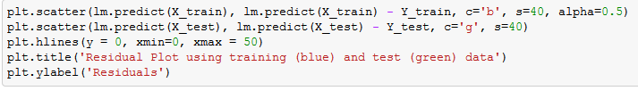
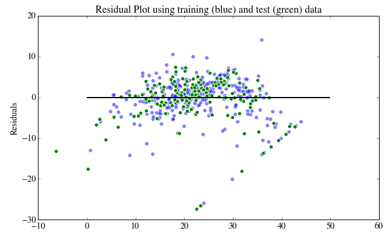

# Notes on Linear Regression in Python

## How to run Linear regression in Python scikit-Learn

- sckit-learn: a powerful Python module of machine learning, containing functionality for regression, classification, clustering, model selection and dimensionality reduction
- `sklearn.linear_model` module: contains "methods intended for regression in which the target value is expected to be a linear combination of the input variables"

### Exploring Boston Housing Data Set

Step 1: import required libraries into notebook:

```Python
import numpy as np
import pandas as pd
import scipy.stats as stats
import matplotlib.pyplot as plt
import sklearn
```

If data set is available in sklearn Python module, it can be imported like:

```Python
from sklearn.datasets import load_boston
boston = load_boston()
```

- Since `boston` is a dictionary, it's keys can be explored using `boston.keys()`
- It's feature names can be printed with `print boston.feature_names`
- `print boston.DESCR` prints the description of the data
- `boston.data` can be converted into pandas dataframe with `bos = pd.Dataframe(boston.data)`
- `bos.columns = boston.feature_names` replaces the default column header numbers with the feature names
- since `boston.target` contains the housing prices, they can be added to the dataframe by `bos['PRICE'] = boston.target`

#### Scikit Learn

This example will use a linear regression model to predict the Boston housing prices, using least squares method to estimate the coefficients.

Y = boston housing price (the "target" data)
X = all other features (or independent variables)

Import linear regression from sci-kit learn module, drop price column (only the parameters should be X values), and store lin reg object in variable `lm`:

```Python
from sklearn.linear_model import LinearRegression
X = bos.drop('PRICE', axis = 1)

# This creates a LinearRegression object
lm = LinearRegression()
lm
```

Pressing tab after typing `LinearRegression.` will give list of functions available inside the linreg object. Some important functions include:

- `lm.fit()`: fits a linear model
- `lm.predict()`: predict Y using the linear model with estimate coefficients
- `lm.score()`: returns the coefficient of determination (R^2); this is a measure of how well observed outcomes are replicated by the model, as the proportion of total variation of outcomes explained by the model

Pressing tab after typing `lm.` explores functions inside lm object including:

- `lm.coef_`: gives the coefficients
- `lm.intercept_`: gives the estimated intercepts

#### Fitting a Linear Model

Using all 13 parameters to fit a linreg model, and passing two additional parameters of `fit_intercept` (Boolean indicating whether to calculate the intercept for the model) and `normalize` (ignored if `fit_intercept` is False; otherwise, normalizes X; although this has been deprecated since version 1.0 of scikit-learn):

In [20]: `lm.fit(X, bos.PRICE)`

Out[20]: `LinearRegression(copy_X=True, fit_intercept=True, normalize=False)`

- Print intercept: `print(lm.intercept_)`
- Print number of coefficients: `print(len(lm.coef_))`

Construct data frame containing features and estimated coefficients:

`pd.Dataframe(zip(X.columns, lm.coef_), columbs = ['features', 'estimatedCoefficients'])`

Can observe from the magnitude of the coefficients any correlations between features and target data, and then choose to plot a scatter plot between them (like between feature of RM and prices, i.e. # of rooms per dwelling and housing prices):

```Python
plt.scatter(bos.RM, bos.PRICE)
plt.xlabel("Average number of rooms per dwelling (RM)")
plt.ylabel("Housing Price")
plt.title("Relationship between RM and Price")
plt.show()
```

Which results in this plot showing positive correlation visually:


#### Predicting Prices

Predicted prices (Y^i) can be calculated using `lm.predict`. The code `lm.predict(X)[0:5]` does so and shows first five housing prices.

A scatter plot can then be used to compare true prices and predicted prices:

```Python
plt.scatter(bos.PRICE, lm.predict(X))
plt.xlabel("Prices: $Y_i$")
plt.ylabel("Predicted prices: $\hat{Y}_i$")
plt.title("Prices vs Predicted Prices: $Y_i$ vs $\hat{Y}_i$")
```

This results in a scatter plot demonstrating positive correlation with some error as housing prices increase.

The **Mean Squared Error** measures how close a fitted line is to data points (take value of the distance of each data point from line of best fit, square it, add all those values for each point, divide by number of points minus two)

The mean squared error can be calculated with:

```Python
mse_full = np.mean((bos.PRICE - lm.predict(X)) ** 2)
print mse_full
```

Since a single feature/parameter is not a good enough predictor of housing prices, the mean squared error will typically decrease with more parameters included in the prediction and increase when there are less.

#### Training and validation data sets

In practice, we split data sets into training and test data sets, to train model on training data and validate its performance on test data.

#### How to do train-test split

Divide your data sets randomly, scikit learn provides a function called `train_test_split` for this:

```Python
X_train, X_test, Y_train, Y_test = sklearn.cross_validation.train_test_split(X, bos.PRICE, test_size=0.33, random_state = 5)
print X_train.shape
print X_test.shape
print Y_train.shape
print Y_test.shape
```

Example Output:
>>> (339, 13)
>>> (167, 13)
>>> (339,)
>>> (167,)

A linear regression model using test-train data sets:

```Python
lm = LinearRegression()
lm.fit(X_train, Y_train)
pred_train = lm.predict(X_train)
pred_test = lm.predict(X_test)
```

And calculation of mean squared error for training and test data:

```Python
print “Fit a model X_train, and calculate MSE with Y_train:”, np.mean((Y_train – lm.predict(X_train)) ** 2)

print “Fit a model X_train, and calculate MSE with X_test, Y_test:”, np.mean((Y_test – lm.predict(X_test)) ** 2)
```

Example Output:
>>> Fit a model X_train, and calculate MSE with Y_train: 19.5467584735 Fit a model X_train, and calculate MSE with X_test, Y_test: 28.5413672756

#### Residual Plots

Residual plots allow data errors to be visualized clearly. They should show randomness, so if there is structure to the datapoints on the plot it's an indication of a factor in target variation not being captured in the current parameters.

Code for residual plots:



Example of residual plot:


