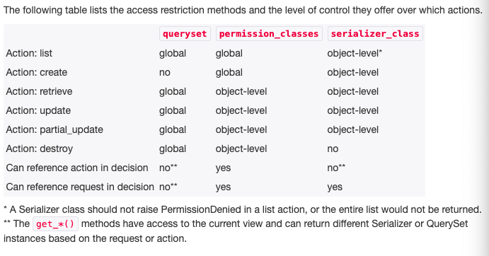

# Notes on Django REST Framework

## Permissions

- together with authentication and throttling, permissions determine whether a request should be granted or denied access
- permission checks are always run at the very start of the view, before any other code is allowed to proceed; they will typically use the authentication information in the `request.user` and `request.auth` properties to determine if the incoming request should be permitted
- permissions are used to grant or deny access for different classes of users to different parts of the API

### How permissions are determined

When the permission checks fail, either a "403 Forbidden" or a "401 Unauthorized" response will be returned, according to the following rules:

- the request was successfully authenticated, but permission was denied. — An HTTP 403 Forbidden response will be returned
- the request was not successfully authenticated, and the highest priority authentication class does not use `WWW-Authenticate` headers. — An HTTP 403 Forbidden response will be returned
- the request was not successfully authenticated, and the highest priority authentication class does use `WWW-Authenticate` headers. — An HTTP 401 Unauthorized response, with an appropriate `WWW-Authenticate` header will be returned.

### Object level permissions

- REST framework permissions also support object-level permissioning
- object level permissions are used to determine if a user should be allowed to act on a particular object, which will typically be a model instance
- object level permissions are run by REST framework's generic views when `.get_object()` is called
- as with view level permissions, an `exceptions.PermissionDenied` exception will be raised if the user is not allowed to act on the given object

### Setting the permission policy

- default permission policy may be set globally, using the DEFAULT_PERMISSION_CLASSES setting
- if not specified, this setting defaults to allowing unrestricted access
- you can also set the authentication policy on a per-view, or per-viewset basis, using the `APIView` class-based views
- or, if you're using the `@api_view` decorator with function based view

## API Reference

- `AllowAny` permission class will allow unrestricted access, regardless of if the request was authenticated or unauthenticated
- `IsAuthenticated` permission class will deny permission to any unauthenticated user, and allow permission otherwise
- `IsAdminUser` permission class will deny permission to any user, unless user.is_staff is True in which case permission will be allowed
- `IsAuthenticatedOrReadOnly` will allow authenticated users to perform any request. Requests for unauthorised users will only be permitted if the request method is one of the "safe" methods; `GET`, `HEAD` or `OPTIONS`
- `DjangoModelPermissions` ties into Django's standard django.contrib.auth model permissions. This permission must only be applied to views that have a .queryset property or get_queryset() method. Authorization will only be granted if the user is authenticated and has the relevant model permissions assigned
  - `POST` requests require the user to have the add permission on the model.
  - `PUT` and `PATCH` requests require the user to have the change permission on the model.
  - `DELETE` requests require the user to have the delete permission on the model.
  - to use custom model permissions, override `DjangoModelPermissions` and set the `.perms_map` property. Refer to the source code for details
- `DjangoObjectPermissions` ties into Django's standard object permissions framework that allows per-object permissions on models. In order to use this permission class, you'll also need to add a permission backend that supports object-level permissions, such as django-guardian

## Custom Permissions

- to implement a custom permission, override BasePermission and implement either, or both, of the following methods:
  - `.has_permission(self, request, view)`
  - `.has_object_permission(self, request, view, obj)`

## Access Restriction Methods

### Third Party Packages

Available third party packages include:

- DRF - Access Policy
- Composed Permissions
- REST Condition
- DRY Rest Permissions
- Django Rest Framework Roles
- Django REST Framework API Key
- Django Rest Framework Role Filters
- Django Rest Framework PSQ
