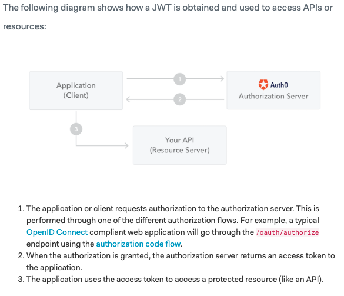

# Notes on Authentication & Production Server

## Introduction to JSON Web Tokens

- JSON Web Token (JWT) is an open standard (RFC 7519) that defines a compact and self-contained way for securely transmitting information between parties as a JSON object.
- This information can be verified and trusted because it is digitally signed.
- JWTs can be signed using a secret (with the HMAC algorithm) or a public/private key pair using RSA or ECDSA.

### Scenarios where JSON Web Tokens are useful

- Authorization: This is the most common scenario for using JWT. Once the user is logged in, each subsequent request will include the JWT, allowing the user to access routes, services, and resources that are permitted with that token.
  - Single Sign On is a feature that widely uses JWT nowadays, because of its small overhead and its ability to be easily used across different domains.
- Information Exchange: JSON Web Tokens are a good way of securely transmitting information between parties.
  - Because JWTs can be signed—for example, using public/private key pairs—you can be sure the senders are who they say they are
  - Additionally, as the signature is calculated using the header and the payload, you can also verify that the content hasn't been tampered with.

### Structure

In its compact form, JSON Web Tokens consist of three parts separated by dots (.), which are:

- Header
- Payload
  - Registered claims: These are a set of predefined claims which are not mandatory but recommended, to provide a set of useful, interoperable claims. Some of them are: iss (issuer), exp (expiration time), sub (subject), aud (audience), and others.
  - Notice that the claim names are only three characters long as JWT is meant to be compact.
  - Public claims: These can be defined at will by those using JWTs. But to avoid collisions they should be defined in the IANA JSON Web Token Registry or be defined as a URI that contains a collision resistant namespace.
  - Private claims: These are the custom claims created to share information between parties that agree on using them and are neither registered or public claims.
- Signature

### How JSON Web Tokens Work

### How to Use JWT Authentication with Django REST Framework

More information on backend implementation and customization can be found [here](https://github.com/davesque/django-rest-framework-simplejwt)
