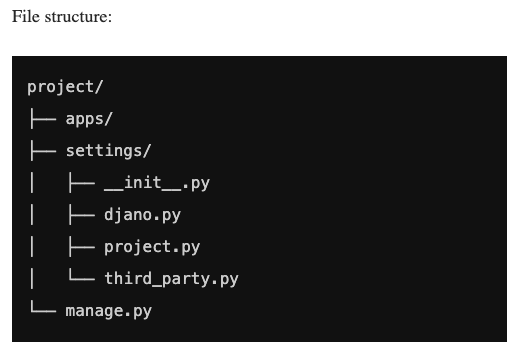
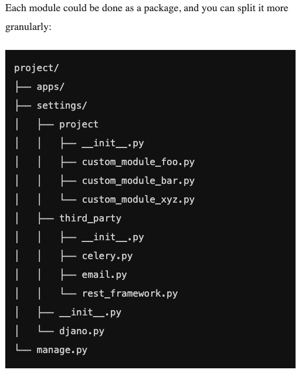

# Notes on API Deployment

## Configuring Django Settings: Best Practices

### Managing Django Settings: Issues

- different environments: there are usually several environments with their own specific settings, so an approach is needed to keep all these Django setting configurations
- sensitive data: data like `SECRET_KEY`, DB passwords and tokens for third party APIs cannot be stored in VCS
- sharing settings between team members: a general approach is needed to eliminate human error when working with settings (i.e. a developer adds third-party app or API integration but doesn't add specific needed settings)
- Django settings are a Python code: gives a lot of flexibility, but can also be a problem (settings.py can have trickier logic than simple key-value pairs)

### Setting Configuration: Different Approaches

`settings_local.py`:

- oldest method
- Pros:
  - Secrets not in VCS.
- Cons:
  - settings_local.py is not in VCS, so you can lose some of your Django environment settings.
  - The Django settings file is a Python code, so settings_local.py can have some non-obvious logic
  - You need to have settings_local.example (in VCS) to share the default configurations for developers.

Separate setting file for each environment:

- extension of previous approach
- Pros:
  - All environments are in VCS.
  - It’s easy to share settings between developers.
- Cons:
  - You need to find a way to handle secret passwords and tokens.
  - “Inheritance” of settings can be hard to trace and maintain.

Environmental variables:

- Pros:
  - Configuration is separated from code.
  - Environment parity – you have the same code for all environments.
  - No inheritance in settings, and cleaner and more consistent code.
  - There is a theoretical grounding for using environment variables – 12 Factors.
- Cons:
  - You need to handle sharing default config between developers.

### 12 Factors

Created by Heroku, a collection of recommendations on how to build distributed web-apps that will be easy to deploy and scale in the Cloud:

1. Codebase
2. Dependencies
3. Config
4. Backing services
5. Build, release, run
6. Processes
7. Port binding
8. Concurrency
9. Disposability
10. Dev/prod parity
11. Logs
12. Admin processes

### django-environ

- environment variables are the perfect place to store settings
- django-environ is best. it is a merge of:
  - envparse
  - honcho
  - dj-database-url
  - dj-search-url
  - dj-config-url
  - django-cache-url

### Setting Structure

### Naming Conventions

Simple rules for our custom (project) settings:

- Give meaningful names to your settings.
- Always use the prefix with the project name for your custom (project) settings.
- Write descriptions for your settings in comments.

### Django Settings: Best practices

- Keep settings in environment variables.
- Write default values for production configuration (excluding secret keys and tokens).
- Don’t hardcode sensitive settings, and don’t put them in VCS.
- Split settings into groups: Django, third-party, project.
- Follow naming conventions for custom (project) settings.
