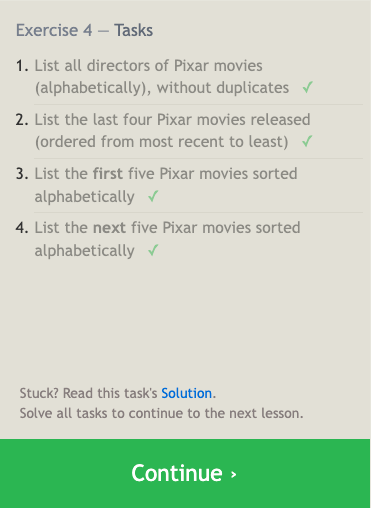

# Notes on SQL Practice

## Lesson 1: SELECT queries 101

Select query for a specific columns:

```SQL
SELECT column, another_column, …
FROM mytable;
```

Select query for all columns:

```SQL
SELECT * 
FROM mytable;
```


## Lesson 2: Queries with constraints (Pt. 1)

Select query with constraints:

```SQL
SELECT column, another_column, …
FROM mytable
WHERE condition
    AND/OR another_condition
    AND/OR …;
```

|       Operator      | Condition                                            | SQL Example                   |
|:-------------------:|------------------------------------------------------|-------------------------------|
|  =, !=, < <=, >, >= | Standard numerical operators                         | col_name != 4                 |
|   BETWEEN … AND …   | Number is within range of two values (inclusive)     | col_name BETWEEN 1.5 AND 10.5 |
| NOT BETWEEN … AND … | Number is not within range of two values (inclusive) | col_name NOT BETWEEN 1 AND 10 |
|        IN (…)       | Number exists in a list                              | col_name IN (2, 4, 6)         |
|      NOT IN (…)     | Number does not exist in a list                      | col_name NOT IN (1, 3, 5)     |


## Lesson 3: Queries with constraints (Pt. 2)

|  Operator  | Condition                                                                                             | Example                                                            |
|:----------:|-------------------------------------------------------------------------------------------------------|--------------------------------------------------------------------|
|      =     | Case sensitive exact string comparison (notice the single equals)                                     | col_name = "abc"                                                   |
|  != or <>  | Case sensitive exact string inequality comparison                                                     | col_name != "abcd"                                                 |
|    LIKE    | Case insensitive exact string comparison                                                              | col_name LIKE "ABC"                                                |
|  NOT LIKE  | Case insensitive exact string inequality comparison                                                   | col_name NOT LIKE "ABCD"                                           |
|      %     | Used anywhere in a string to match a sequence of zero or more characters (only with LIKE or NOT LIKE) | col_name LIKE "%AT%" (matches "AT", "ATTIC", "CAT" or even "BATS") |
|      _     | Used anywhere in a string to match a single character (only with LIKE or NOT LIKE)                    | col_name LIKE "AN_" (matches "AND", but not "AN")                  |
|   IN (…)   | String exists in a list                                                                               | col_name IN ("A", "B", "C")                                        |
| NOT IN (…) | String does not exist in a list                                                                       | col_name NOT IN ("D", "E", "F")                                    |

Select query with constraints:

```SQL
SELECT column, another_column, …
FROM mytable
WHERE condition
    AND/OR another_condition
    AND/OR …;
```


## Lesson 4: Filtering and sorting Query results

Select query with unique results:

```SQL
SELECT DISTINCT column, another_column, …
FROM mytable
WHERE condition(s);
```

Select query with ordered results:

```SQL
SELECT column, another_column, …
FROM mytable
WHERE condition(s)
ORDER BY column ASC/DESC;
```

Select query with limited rows:

```SQL
SELECT column, another_column, …
FROM mytable
WHERE condition(s)
ORDER BY column ASC/DESC
LIMIT num_limit OFFSET num_offset;
```



## Lesson 5: (Review) Simple SELECT Queries

Completed review:


## Lesson 6: Multi-table queries with JOINs

Select query with INNER JOIN on multiple tables:

```SQL
SELECT column, another_table_column, …
FROM mytable
INNER JOIN another_table 
    ON mytable.id = another_table.id
WHERE condition(s)
ORDER BY column, … ASC/DESC
LIMIT num_limit OFFSET num_offset;
```


## Lesson 13: Inserting rows

Insert statement with values for all columns:

```SQL
INSERT INTO mytable
VALUES (value_or_expr, another_value_or_expr, …),
       (value_or_expr_2, another_value_or_expr_2, …),
       …;
```

Insert statement with specific columns:

```SQL
INSERT INTO mytable
(column, another_column, …)
VALUES (value_or_expr, another_value_or_expr, …),
      (value_or_expr_2, another_value_or_expr_2, …),
      …;
```


## Lesson 14: Updating rows

Update statement with values:

```SQL
UPDATE mytable
SET column = value_or_expr, 
    other_column = another_value_or_expr, 
    …
WHERE condition;
```


## Lesson 15: Deleting rows

Delete statement with condition:

```SQL
DELETE FROM mytable
WHERE condition;
```


## Lesson 16: Creating tables

Create table statement w/ optional table constraint and default value:

```SQL
CREATE TABLE IF NOT EXISTS mytable (
    column DataType TableConstraint DEFAULT default_value,
    another_column DataType TableConstraint DEFAULT default_value,
    …
);
```

| Data type | Description |
|---|---|
| INTEGER, BOOLEAN | The integer datatypes can store whole integer values like the count of a number or an age. In some implementations, the boolean value is just represented as an integer value of just 0 or 1. |
| FLOAT, DOUBLE, REAL | The floating point datatypes can store more precise numerical data like measurements or fractional values. Different types can be used depending on the floating point precision required for that value. |
| CHARACTER(num_chars), VARCHAR(num_chars), TEXT | The text based datatypes can store strings and text in all sorts of locales. The distinction between the various types generally amount to underlaying efficiency of the database when working with these columns. Both the CHARACTER and VARCHAR (variable character) types are specified with the max number of characters that they can store (longer values may be truncated), so can be more efficient to store and query with big tables. |
| DATE, DATETIME | SQL can also store date and time stamps to keep track of time series and event data. They can be tricky to work with especially when manipulating data across timezones. |
| BLOB | Finally, SQL can store binary data in blobs right in the database. These values are often opaque to the database, so you usually have to store them with the right metadata to requery them. |


## Lesson 17: Altering tables

Altering table to add new column(s):

```SQL
ALTER TABLE mytable
ADD column DataType OptionalTableConstraint 
    DEFAULT default_value;
```

Altering table to remove column(s):

```SQL
ALTER TABLE mytable
DROP column_to_be_deleted;
```

Altering table name:

```SQL
ALTER TABLE mytable
RENAME TO new_table_name;
```


## Lesson 18: Dropping tables

Drop table statement:

```SQL
DROP TABLE IF EXISTS mytable;
```


